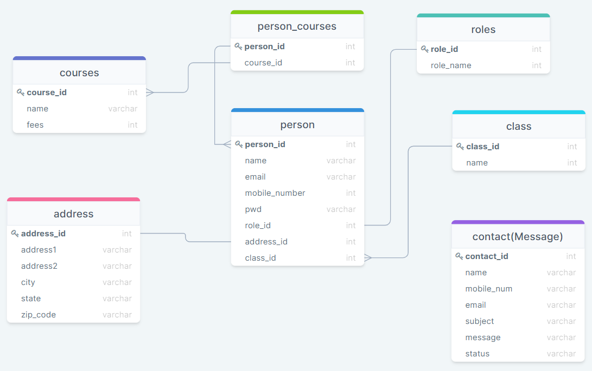
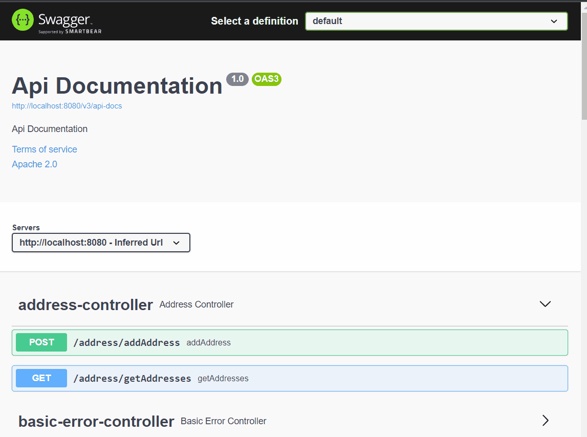

# SchoolWebApp [REST API]
This is a REST Api I built to practice my **Java** and **Spring Boot framework** skills. 🙂

## Build with 🛠️
* [MySQL](https://www.mysql.com) - Data Base.
* [Java-17](https://www.oracle.com/java/technologies/javase/jdk17-archive-downloads.html) - Backend Programming Language.
* [Bootstrap-4](https://getbootstrap.com) - Frontend styling framework.
* [Spring Boot 2.5.6](https://spring.io/blog/2021/10/21/spring-boot-2-5-6-is-now-available) - Backend Framework.
* [Spring Data JPA](https://spring.io/projects/spring-data-jpa) - Java Persistence API

## Features ✔😎
* REST Api contains students, classes, roles, courses and messages.
* Database relationships One-to-Many, Many-to-Many, One-to-One.
* Implementing Data Transfer Objects (DTO).
* Admin/Users can Create-Read-Update-Delete-Search students, classes, courses, messages and roles.
* Swagger to test API.

## Authors ✒️

* **Oriol Cortez Cesar** - [Dev-OriolCC](https://github.com/Dev-OriolCC)

## Screenshots and gifs 📸

_1.1 Database_
____

_1.2 Endpoints_
----

----

